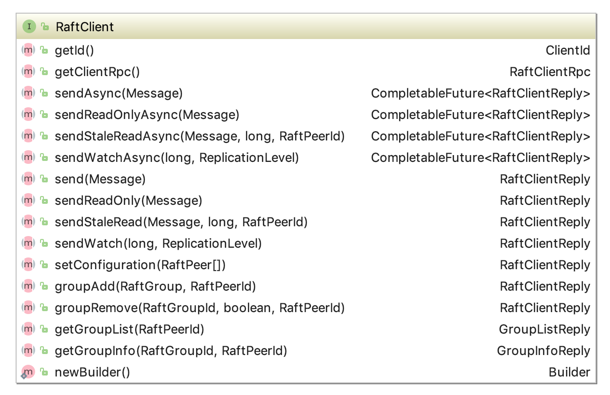
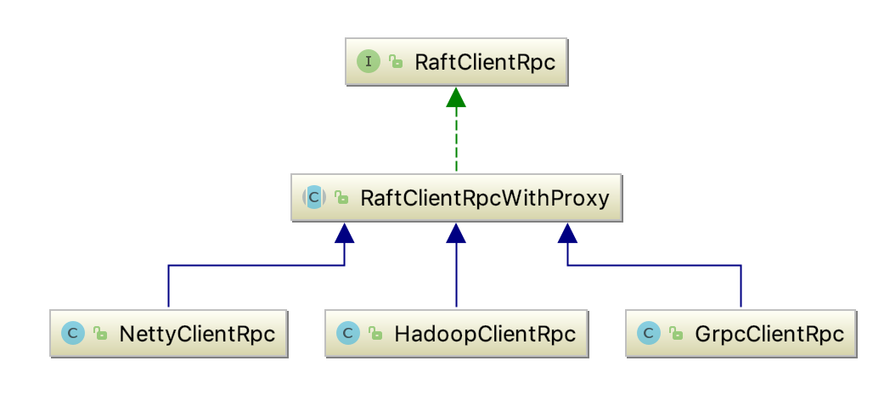
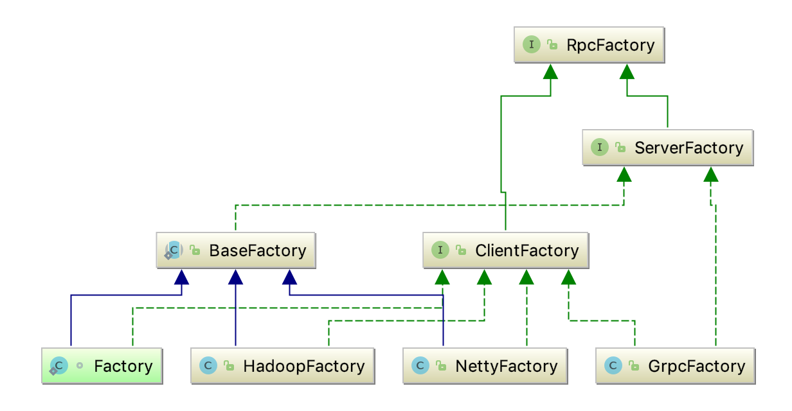
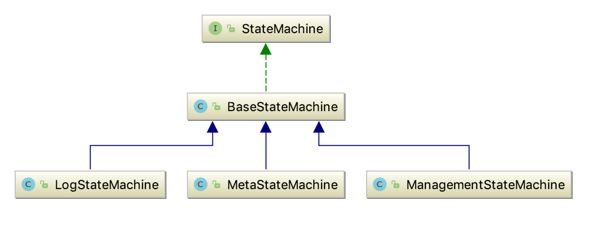
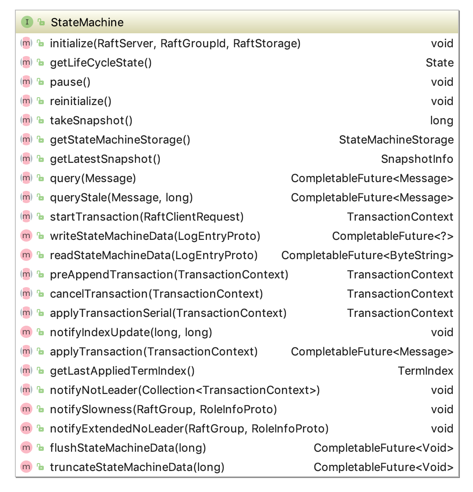

```
├── ratis-assembly
├── ratis-client
├── ratis-common
├── ratis-examples
├── ratis-netty
├── ratis-logservice
├── ratis-proto
├── ratis-replicated-map
├── ratis-server
├── ratis-test
├── ratis-grpc
├── ratis-hadoop
```


## RPC模块
RPC 模块用于节点之间的网络通讯:  
RPC Server: 内置于 Node 内的 RPC 服务器，接收其他节点或者客户端发过来的请求，转交给对应服务处理。  
RPC Client: 用于向其他节点发起请求，例如投票、复制日志、心跳等。  

**RaftClient**   
主要接口如下

RaftClient的实现类RaftClientImpl，里面会持有一个RaftClientRpc，具体的rpc client实现有提供了如下几种


Client和Server都是通过factory产生的

后面我重点了解grpc rpc实现

## ratis-server核心模块

## State Machine


stateMachine的主要接口：


### FileStoreStateMachine
